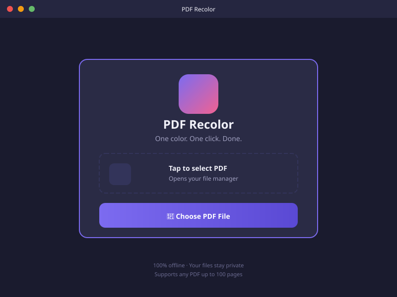
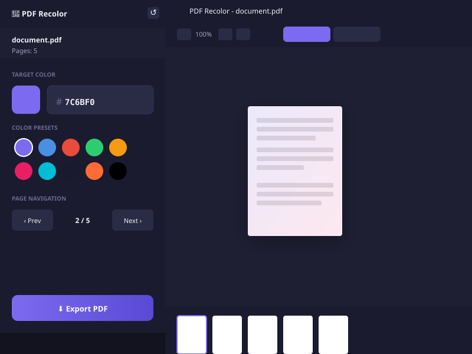

  
  
  
  

<h1 align="center">
  
   
  PDF Recolor
</h1>

  <strong>Transform your PDF documents with stunning color schemes in one click</strong>
   
  A powerful Windows desktop application for recoloring PDF documents with ease

 

  <a href="#-features"><strong>Features</strong></a> •
  <a href="#-screenshots"><strong>Screenshots</strong></a> •
  <a href="#-getting-started"><strong>Getting Started</strong></a> •
  <a href="#-keyboard-shortcuts"><strong>Shortcuts</strong></a> •
  <a href="#-technical-stack"><strong>Tech Stack</strong></a>

---

## ✨ Features

### 🎨 Beautiful Color Controls
- **Native Color Picker** - Pick any color from the full spectrum
- **Hex Code Input** - Enter exact hex codes for precision
- **10 Preset Colors** - Quick access to popular color schemes

### 📄 Powerful PDF Processing
- **Drag & Drop** - Simply drop your PDF files
- **Multi-page Support** - Handle documents up to 100 pages
- **Real-time Preview** - See changes instantly before exporting

### 🔍 Advanced Navigation
- **Thumbnail Strip** - Quick visual page navigation
- **Zoom Controls** - Zoom in/out with buttons or Ctrl+scroll
- **Fit to Window** - Auto-fit pages to your screen

### ⚡ Compare Mode
- **Side-by-Side View** - Hold spacebar to compare original vs recolored
- **Toggle Views** - Switch between colored and original with one click

### 💾 Easy Export
- **Auto-save to Downloads** - Export directly to your Downloads folder
- **Smart Naming** - Files are named with color code for easy identification

---

## 📷 Screenshots

| Upload Screen | Editor View |
|:---:|:---:|
|  |  |

---

## 🚀 Getting Started

### Download

**Latest Release:** [PDF Recolor v1.0.0](https://github.com/Rocker14427c/PDFRecolor-Windows/releases/latest)

Download the portable executable and run it directly - no installation required!

### Quick Start

1. **Launch** the application
2. **Drop** a PDF file onto the window or click "Choose PDF File"
3. **Select** your target color using:
   - Color picker (click the color swatch)
   - Hex code input (e.g., `7C6BF0`)
   - Preset color chips
4. **Preview** the recolored result in real-time
5. **Compare** by holding `Spacebar` to see the original
6. **Export** when satisfied - saved to Downloads automatically

---

## ⌨️ Keyboard Shortcuts

| Shortcut | Action |
|:---|:---|
| `←` / `PageUp` | Previous page |
| `→` / `PageDown` | Next page |
| `Home` | First page |
| `End` | Last page |
| `Spacebar` (hold) | Compare with original |
| `Ctrl` + `+` | Zoom in |
| `Ctrl` + `-` | Zoom out |
| `Ctrl` + `0` | Reset zoom |
| `Ctrl` + `Scroll` | Zoom with mouse wheel |

---

## 🎨 Color Presets

| Color | Hex Code |
|:---:|:---:|
| 🟣 Purple | `#7C6BF0` |
| 🔵 Blue | `#4A90E2` |
| 🔴 Red | `#E74C3C` |
| 🟢 Green | `#2ECC71` |
| 🟠 Amber | `#F39C12` |
| 💗 Pink | `#E91E63` |
| 🔵 Cyan | `#00BCD4` |
| ⚫ Dark | `#1A1A2E` |
| 🟠 Orange | `#FF6B35` |
| ⬛ Black | `#000000` |

---

## 🔧 Technical Stack

| Technology | Purpose |
|:---|:---|
| **Electron 28** | Cross-platform desktop framework |
| **PDF.js** | High-performance PDF rendering |
| **pdf-lib** | PDF creation and manipulation |
| **JavaScript** | Core application logic |
| **CSS3** | Modern responsive styling |

---

## 📋 System Requirements

| Requirement | Minimum |
|:---|:---|
| **OS** | Windows 10/11 (64-bit) |
| **RAM** | 4 GB |
| **Disk Space** | 200 MB |
| **Display** | 1024 x 768 resolution |

---

## 🔒 Privacy

- **100% Offline Processing** - Your files never leave your computer
- **No Data Collection** - No telemetry or tracking
- **Local Storage Only** - Files are processed and saved locally

---

## 📄 License

This project is licensed under the **MIT License** - see the [LICENSE](LICENSE) file for details.

---

## 🤝 Contributing

Contributions are welcome! Feel free to submit issues and pull requests.

1. Fork the repository
2. Create your feature branch (`git checkout -b feature/AmazingFeature`)
3. Commit your changes (`git commit -m 'Add some AmazingFeature'`)
4. Push to the branch (`git push origin feature/AmazingFeature`)
5. Open a Pull Request

---

  <strong>Made with ❤️ for Windows users</strong>
   
  If you find this project useful, please ⭐ star the repository!

